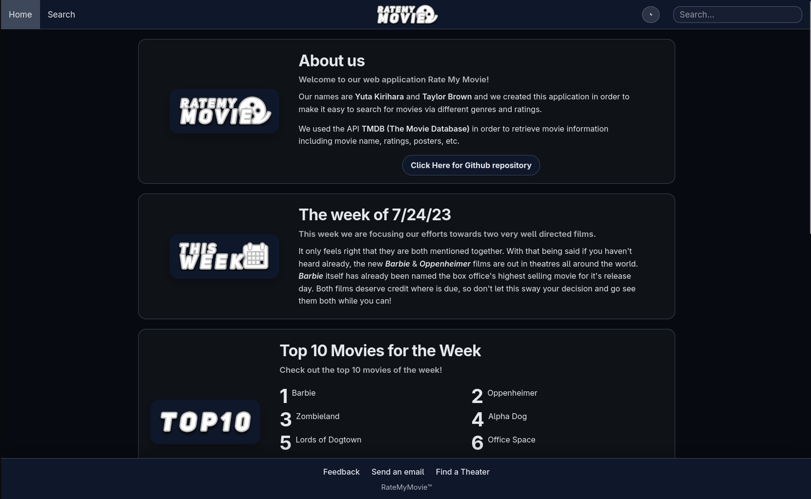
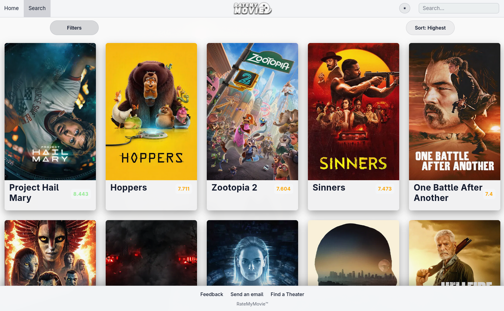
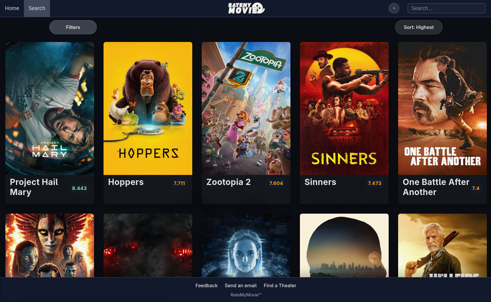

# Rate My Movie

A movie discovery web app built for Project #1 in the University of Minnesota Full-Stack Coding Bootcamp (Summer 2023).

Rate My Movie helps users quickly browse and search films with filtering options such as genre and rating. The app uses TMDB (The Movie Database) to display up-to-date movie details including titles, posters, overviews, and ratings.

## Features

- Browse trending and featured movie content from TMDB
- Search for movies with filter options (for example, genre and rating)
- View key movie information in a simple, responsive interface
- Switch between light and dark themes

## Built With

- HTML
- CSS
- JavaScript
- [TMDB API](https://www.themoviedb.org/documentation/api)

## Installation

No installation is required.

1. Clone this repository.
2. Open `index.html` in your browser.

## Usage

1. Open the homepage to view movie highlights.
2. Navigate to the search view to find movies by your preferred filters.
3. Toggle the theme switcher to choose light or dark mode.

## Screenshots

### Home

### Light Theme

### Dark Theme

## Credits

Created by Yuta Kirihara and Taylor Brown.

## License

MIT License. See `LICENSE` for details.
